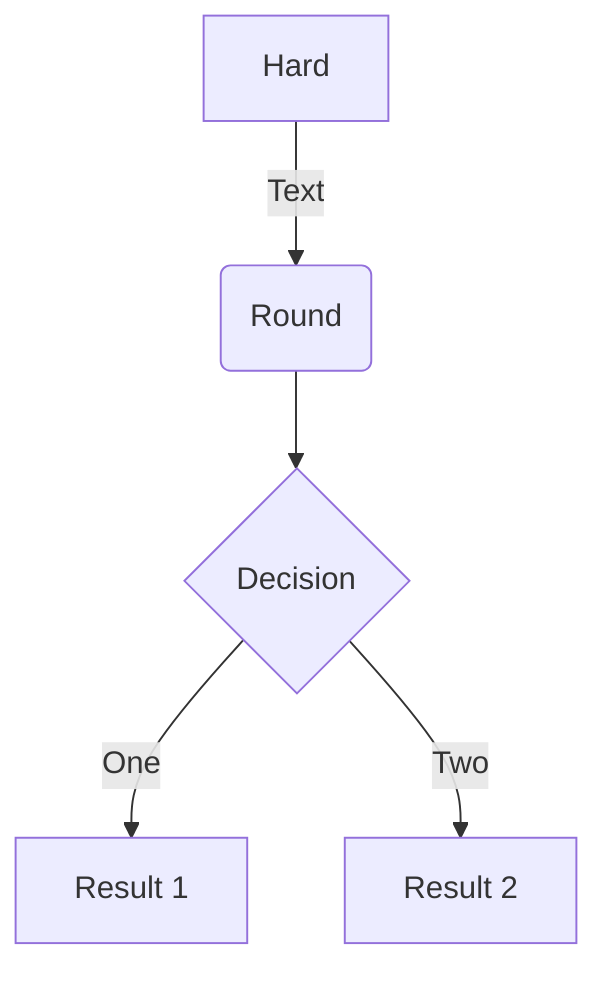

# Mermaid

* [https://squidfunk.github.io/mkdocs-material/reference/diagrams/](
   https://squidfunk.github.io/mkdocs-material/reference/diagrams/){:target="_blank"}

## Setup

```yaml
markdown_extension:
  - pymdownx.superfences:
      custom_fences:
        - name: mermaid
          class: mermaid
          format: !!python/name:pymdownx.superfences.fence_code_format
```

## Examples



